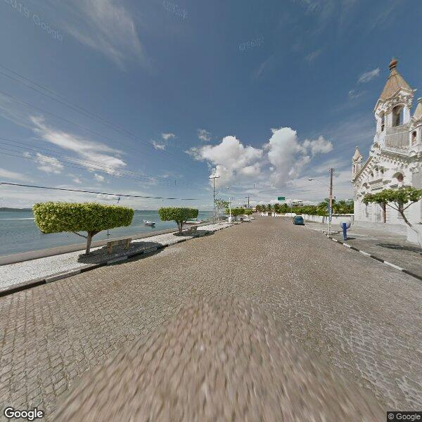
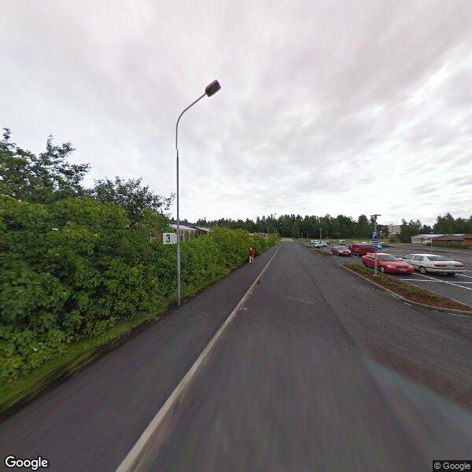
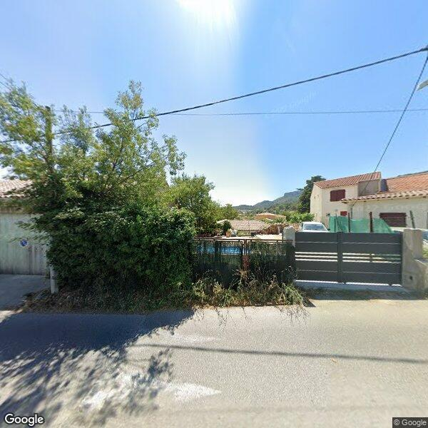
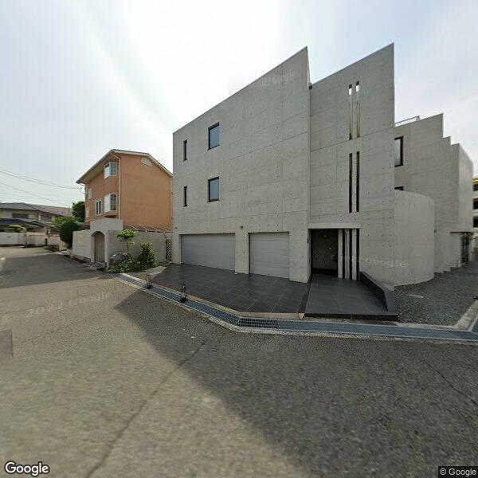
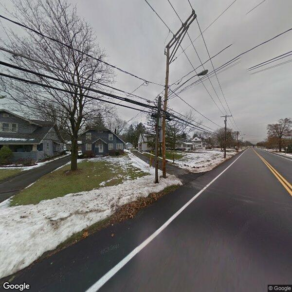

# streetViewGuessr
AI powered Street View image country guesser, inspired by GeoGuessr.

Given input images, tries to guess which country the image is taken in.
The model is trained using Google Street View images from Brazil, France, Finland, Japan and US.

## Example
An example for inference can be found in the file `guess.py`.
The model is trained on ~200 images for each class using the script in `train.py`.
This achieves an approximately 85% top-1 accuracy on a large testing set.


```
True: BR, Guess: BR
Probabilities: BR: 91.4%, FI: 2.4%, FR: 0.2%, JP: 5.6%, US: 0.3%, 
```


```
True: FI, Guess: FI
Probabilities: BR: 0.3%, FI: 81.9%, FR: 2.3%, JP: 14.4%, US: 1.0%, 
```


```
True: FR, Guess: FR
Probabilities: BR: 16.1%, FI: 1.8%, FR: 63.3%, JP: 13.1%, US: 5.7%, 
```


```
True: JP, Guess: JP
Probabilities: BR: 13.6%, FI: 10.7%, FR: 29.7%, JP: 37.7%, US: 8.3%, 
```


```
True: US, Guess: US
Probabilities: BR: 1.4%, FI: 6.9%, FR: 2.2%, JP: 38.7%, US: 50.8%, 
```

## API key
The `download.py` script requires a Google Maps API key.
Create a file called `config.py` with the content
```
api_key = "YOUR_API_KEY_HERE"
```
